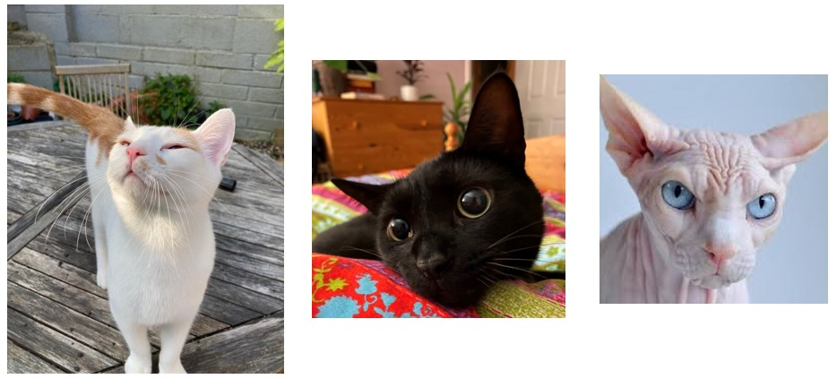
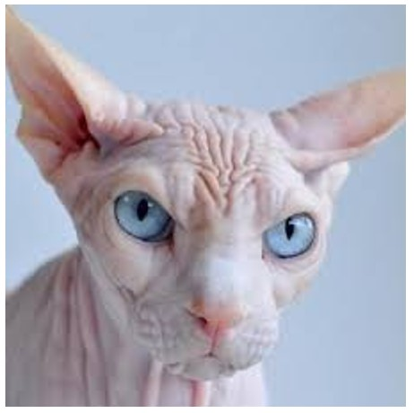

# Dictionaries

## Learning Objectives

- What are dictionaries in Python?
- What are Key Value Pairs?
- How can KVPs be used to model objects?
- How are dictionaries declared and used?

## Introducing Dictionaries

Dictionaries are containers for collections of key value pairs. 

A key value pair (KVP) is just a set of values that are associated with each other. Dictionaries can store an almost limitless amount of pairs.

Although the syntax is a little trickier, dictionaries are quite similar to lists, except each item has two components, the key and value. We can add, remove, edit, and retrieve keys, values, or both. We can also loop through our dictionaries just like lists. 

We declare dictonaries using curly brackets {}

### Return of the Cats - Weasley, Noche, and... Mr. Bigglesworth?

We've already met Dumb and Dumber, but they also have a friend... some sort of uglier, wrinklier, vampire, house elf???



### Creating a Dictionary

A common use of dictionaries is to represent real world objects, here is one representing Weasley.

```py
weasley = {'fur': 'white and ginger', 'eyes': 'yellow', 'toes': 'pink'}
```

A variable called `weasley` is declared, and assigned the value of the dictionary.

It is common to use a new line for each item to give improved readability because the keys all line up - but watch your indentation!

```py
weasley = { 
    'fur': 'white and ginger',
    'eyes': 'yellow',
    'toes': 'pink'
    }

```

### Calling Values from a Dictionary

You can see in the below example the syntax to retrieve values from the dictionary by specifying the key.


```py
weasley = { 
    'fur': 'white and ginger',
    'eyes': 'yellow',
    'toes': 'pink'
    }

print(weasley['fur'])
print(weasley['eyes'])
print(weasley['toes'])

print(f"Weasley! What have you been rolling in? Your {weasley['fur']} fur is covered in something nasty, eugh!")
```

We can also call the values from a dictionary within f-strings.

### Adding New Key-Value Pairs and Modifying a Dictionary

Add new KVPs to your dictionaries by simply stating the name and the new key and value; You may also start with an empty dictionary.

```py
weasley = { 
    'fur': 'white and ginger',
    'eyes': 'yellow',
    'toes': 'pink'
    }
noche = {}

weasley['age'] = 1

noche['fur'] = 'black'
noche['eyes'] = 'green'
noche['toes'] = 'black'
noche['age'] = 2

print(weasley, noche)
```

The same syntax can be used to update the value of an existing KVP, as seen below.

### Copying a dictionary 

Devil Cat wants a dictionary too...



...or he'll eat your soul!!!

If you need to make several similar dictionaries you can make a new dictionary from an existing dictionary using the `dict()` function. *Notice the `fur` and `age` values for Bigglesworth are modified after copying from Weasley*.

```py
weasley = { 
    'fur': 'white and ginger',
    'eyes': 'yellow',
    'toes': 'pink'
    }
noche = {}

#Add to an existing dictionary
weasley['age'] = 1

#Copy an existing dictionary and modify the new one
bigglesworth = dict(weasley)
bigglesworth['fur'] = 'none'
bigglesworth['age'] = 666

#Populate an empty dictionary
noche['fur'] = 'black'
noche['eyes'] = 'green'
noche['toes'] = 'black'
noche['age'] = 2

print("Weasley's attributes are:")
print(weasley)
print("Noche's attributes are:")
print(noche)
print("Bigglesworth's attributes are:")
print(bigglesworth)
```

### Removing key value pairs

Remove key value pairs with `del`.

```py
...
#Populate an empty dictionary
noche['fur'] = 'black'
noche['eyes'] = 'green'
noche['toes'] = 'black'
noche['age'] = 2

#Delete a value from a dictionary
del bigglesworth['fur'] #because he doesn't have any!

print("Weasley's attributes are:")
print(weasley)
print("Noche's attributes are:")
print(noche)
print("Bigglesworth's attributes are:")
print(bigglesworth)
```

## Using loops with Dictionaries

Think back to when we first learned `for` loops; We used them to iterate through some input, such as a list. The syntax for the loop was `for x in [list]:` and we explained that `x` acts as a temporary variable, which takes the value of each item as the loop iterates through the list. It doesn't need to be called `x`, commonly we would use something a little more logical like `for food in foods` or `for name in people`.

Well, the logic of using a loop with a dictionary is not too different, except because each item in the list has two components, we may need two temporary variables.

Here is an example of the syntax.

```py
weasley = { 
    'fur': 'white and ginger',
    'eyes': 'yellow',
    'toes': 'pink'
    }

for key, value in weasley.items():
    print(f"The key is {key} and the value is {value}")
```

### Dictionary Methods

In the previous example we iterates through all of the keys and values in the dictionary by using the `.items()` dictionary method. This required two temporary variables, one for the key and another for the value, of each iteration. 

You can also iterate through just the keys in a dictionary using `.keys()` or just the values using `.values()`. 

For these methods you only need to provide one temporary variable.

```py
weasley = { 
    'fur': 'white and ginger',
    'eyes': 'yellow',
    'toes': 'pink'
    }

for key in weasley.keys():
    print(f"The keys are: {key}")
for value in weasley.values():
    print(f"The values are: {value}")
```

### Sorting a Dictionary

Sort your dictionaries using `sorted()`.

Remember to **wrap** your `sorted()` around the dictionary you want to sort! 

```py
weasley = { 
    'fur': 'white and ginger',
    'eyes': 'yellow',
    'toes': 'pink'
    }

for key in sorted(weasley.keys()):
    print(f"The keys are: {key}")
```

## Nesting

You might want to store a list inside a dictionary, or a dictionary inside a list… This is called nesting. 

### A List of Dictionaries

If you have multiple dictionaries that you need to work with, you could add them to a list.

```py
weasley = { 
    'fur': 'white and ginger',
    'eyes': 'yellow',
    'toes': 'pink'
    }

noche = { 
    'fur': 'black',
    'eyes': 'green',
    'toes': 'pink'
    }

bigglesworth = { 
    'fur': 'none',
    'eyes': 'red',
    'toes': 'cloven hoofs'
    }

cats = [weasley, noche, bigglesworth]

for cat in cats:
    print(cat)
```

### A List in a Dictionaries

If you want to provide multiple values for a key in your dictionary, you can add the values to a list, and make the list the value for the key.

```py
bigglesworth = { 
    'fur': 'none',
    'eyes': 'souls of the damned',
    'toes': 'cloven hoofs'
    'favourite foods': ['joy', 'happiness', 'souls', 'tuna - occasionally']
    }

for food in bigglesworth['favourite foods']:
    print(f"Bigglesworth just loves eating {food}")
```

### A Dictionary in a Dictionary

You can also have a dictionary within a dictionary, a dictionary of dictionaries, but things can get complicated, so be careful!

```py
cats = {
    'weasley' : { 
        'fur': 'white and ginger',
        'eyes': 'yellow',
        'toes': 'pink'
        },

    'noche' : { 
        'fur': 'black',
        'eyes': 'green',
        'toes': 'pink'
        },

    'bigglesworth' : { 
        'fur': 'none',
        'eyes': 'red',
        'toes': 'cloven hoofs'
        }
}

for cat_name, cat_info in cats.items():
    print(cat_name)
    print(cat_info)
```

## Practice Using Dictionaries

Please complete the dictionary exercises from the repository.