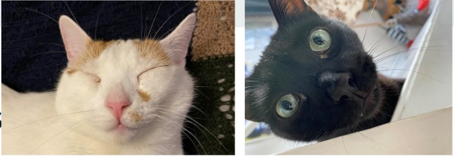

# Files and Exceptions

## Learning Objectives

- Explain what a class is, how to create one, and what the purpose of them is
- Introduce practical uses of a class (accessing attributes, etc)
- Explore the concept of inheritance and practice using child classes
- How to import classes into another piece of code

## What are Classes?

To understand Classes, first let's start with a more abstract concept...

### What is Object-Oriented Programming?

Python is an example of an object-oriented programming language. 

In object-oriented programming (OOP) we create and work with objects, which are unique instances of *something*!

- If I want to create an app for managing my pet's worm and flea treatments, I need *something* in the app which represents and stores info for each pet. 

- If I want to create a game which has lots of enemies, I need *something* to represent each one, allowing each individual enemy to have it's own characteristics like a health bar, different weapons, etc.

- If I make an app for a coffee shop, each individual coffee, with it's specific options, needs to be tracked from ordering to completion.

These are all examples where object-oriented programming can be useful. Each pet is an object; Each enemy in the game can be an object; Each coffee can be an object; And so on. This approach allows us to write code which works with our objects.

So, if a customer selects Caramel Syrup in their coffee, we can write a line of code which adds that option to the specific object that requires it, but not every object - OOP allows individual objects to be handled differently, such as to be personalised.

### Back to Classes

Classes are how we make objects, they're like object constructors, or a blueprint for creating new objects.

## Creating and Using a Class

You can model almost anything using a class. To start, you use the keyword ‘class’. You just need to think about what you are modelling.

#### Bring in the CATS



Think about what a cat is... They have a name, fur, age... They also do things like sleep and climb on stuff they shouldn't!

We will create a class that will store the name of a cat, the age of the cat and give the cat the ability to climb and sleep.

```py
class Cat():
    #an attempt to model a cat
    def __init__(self, name, age):
        #assign the cats name and age
        self.name = name
        self.age = age

    def sleep(self):
        #The cat can sleep
        print(f"{self.name} is fast asleep like a little angel")

    def climb(self):
        #The cat can sleep
        print(f"Quick! {self.name} is climbing on the roof!")
```

What can we see here?

## Methods

A function that is within a class is called a method and is available to objects created by the class. This is the exact same thing as the functions we created in Module 8, just named something different within classes.

In the example we've created three methods `def __init__(self, name, age)`, `def sleep(self)` and `def climbing(self)`, but the first one is likely the most unfamiliar.

### The `__init__()` Method

```py
class Cat():
    #an attempt to model a cat
    def __init__(self, name, age):
        #assign the cats name and age
        self.name = name
        self.age = age
```

All classes require a function called `__init__()`, which is always executed when the class is being 'initiated'. The `__init__()` method is used to assign values to the individual objects created by the class. In our example we are modelling a class, each object will be a new cat. But each cat needs it's own name, it's own age, it's own fur colour, so the `__init__()` method passes these attributes to the unique object. 

Other operations that are necessary when the object is being created, for example, creating a confirmation message for each created object, can also be carried out in the `__init__()` method.

### The `self` Parameter

The self parameter is a reference to the instance itself; This is a litle confusing, but the point of classes is to make objects - and each object needs to be unique. Imagine you're making a game, and your class creates enemies. Each enemy might start the same, but they each need their own health bar, perhaps you want them to be different colours. So `self` gives each individual instance access to it's own set of attributes, and allows each instance to access the methods from within the class individually. So, if you give your enemies a method allowing them to dodge out of your way, they won't all have to dodge at the same time.

Looking at our example again

```py
class Cat():
    #an attempt to model a cat
    def __init__(self, name, age):
        #assign the cats name and age
        self.name = name
        self.age = age
```

You can see that each cat created by our class can have it's own name and age, we can add more attributes if we wish, weight, colour, etc... By adding attributes as key-value pairs in this manner, we can model almost anything as a class.

One more point about `self`, if you think back to the Functions module, you may remember that if a function requires parameters, we pass arguments through to them when we call the function. However, when we create an instance of a class, we **don't** need to provide an argument for `Self`.

In our example, to call our class and create a cat, we just need to provide the name and age of the cat(s) we want to create. But one last thing first, we also gave them the ability to sleep and climb.

*NOTE: Three dots `...` indicate omitted code.*
```py
...
    def sleep(self):
        #The cat can sleep
        print(f"{self.name} is fast asleep like a little angel")

    def climb(self):
        #The cat can sleep
        print(f"Quick! {self.name} is climbing on the roof!")
```
These functions, or methods since they're within a class, are available to each cat that is created. In this case each method just prints out a message which includes the specific instance's name parameter, saying what the cat is doing. However, the code in the method could do something much more complex.

Ok, let's make Weasley


Below we have our cat class code, then we create a variable and assign it a value by calling the cat class, and providing arguments for name and age.

```py
class Cat():
    #an attempt to model a cat
    def __init__(self, name, age):
        #assign the cats name and age
        self.name = name
        self.age = age

    def sleep(self):
        #The cat can sleep
        print(f"{self.name} is fast asleep like a little angel")

    def climb(self):
        #The cat can sleep
        print(f"Quick! {self.name} is climbing on the roof!")

my_cat = Cat('Weasley', 1)
```

Ok, so where is Weasley?

He has been assigned to the `my_cat` variable. 

## Calling Methods

To call a method simply give the name of the instance, and method you want to call, separated by a dot, just like when we called string methods right back at the beginning, we called it **dot notation.**

```py
class Cat():
    #an attempt to model a cat
    def __init__(self, name, age):
        #assign the cats name and age
        self.name = name
        self.age = age

    def sleep(self):
        #The cat can sleep
        print(f"{self.name} is fast asleep like a little angel")

    def climb(self):
        #The cat can sleep
        print(f"Quick! {self.name} is climbing on the roof!")

my_cat = Cat('Weasley', 1)

my_cat.sleep()
my_cat.climb()
```

## Accessing Attributes

Dot notation also allows us to access the instance's individual attributes directly.

```py
...

my_cat = Cat('Weasley', 1)

print(f"My cat's name is {my_cat.name}")
print(f"My cat is {my_cat.age} years old")
```

## Creating Multiple Instances

Someone is feeling left out


You can create as many instances from a class as you need, just as long as you give each instance a unique variable name.

```py
...

first_cat = Cat('Weasley', 1)
second_cat = Cat('Noche', 2)

print(f"My cats are called {first_cat.name} and {second_cat.name}")
print(f"{first_cat.name} is {first_cat.age} years old, and {second_cat.name} is {second_cat.age}")
```

We could have called the variables 'Weasley' and 'Noche' if we wanted, and that may well be better. Here using `first_cat` and `second_cat` just makes it a little less confusing at first as there's less repetition.

## Default Values for an Attribute

If we want the instances created by a class to have another attribute, which is the same for all or most of the instances, we can add it with a default value.

```py
class Cat():
    #an attempt to model a cat
    def __init__(self, name, age):
        #assign the cats name and age
        self.name = name
        self.age = age
        self.animal_type = 'cat'
```

Now we have an additional attribute for `animal_type` with a default value of `cat`. Since this class makes cats, it makes sense that every object created by it has the same `animal_type`.

We can add a new method, and call upon that attribute just like the others

```py
...
        def animal_species(self):
            print(f"{self.name} is a {self.animal_type}")
...

first_cat.animal_species()
```

### Modifying Attribute Values

An attributes values may be modified directly by simply defining a new value to it using dot notation

```py
...
first_cat = Cat('Weasley', 1)
print(f"{first_cat.name} is {first_cat.age}")
first_cat.age = 3
print(f"{first_cat.name} is {first_cat.age}")
```

You may also create a method to update the value of an attribute which you can call when needed

```py
...
    def climb(self):
        #The cat can sleep
        print(f"Quick! {self.name} is climbing on the roof!")

    def animal_species(self, species):
        self.animal_type = species
        print(f"{self.name} is a {self.animal_type}")

first_cat = Cat('Weasley', 1)
print(f"{first_cat.name} is a {first_cat.animal_type}")
first_cat.animal_species('dog')
```

Here the `animal_species` method has an additional parameter, not included in the `__init__` method, for which we need to provide an argument `dog` when we call it.

## Inheritance

 If you need to create a class which is similar to, or is a specialized version of an existing class, you do not need to start from scratch, you can use inheritance. 
 
 When one class inherits from another, it automatically takes on all the attributes and methods of the first class. The original class is called the parent class, and the new class is the child class. 
 
 The child class inherits every attribute and method from its parent class but is also free to define new attributes and methods of its own.

 ```py
class Cat():
    #An attempt to model a cat
    def __init__(self, name, age):
        #assign the cats name and age
        self.name = name
        self.age = age
        self.animal_type = 'cat'

    def sleep(self):
        #The cat can sleep
        print(f"{self.name} is fast asleep like a little angel")

    def climb(self):
        #The cat can sleep
        print(f"Quick! {self.name} is climbing on the roof!")

    def animal_species(self, species):
        self.animal_type = species
        print(f"{self.name} is a {self.animal_type}")

class Tiger(Cat):
    #A different type of cat
    def __init__(self, name, age)
        super().__init__(name, age)
    
bob_tiger = Tiger('Bob', 12)
bob_tiger.sleep()
```

We've created a `Tiger` class, which is a child of the `Cat` parent class.

### The `super()` function

The `super()` function helps Python make connections between a parent and a child class, and the `__init__` method takes in information required to make a Cat instance.

```py
...
class Tiger(Cat):
    #A different type of cat
    def __init__(self, name, age)
        super().__init__(name, age)
        self.foods = 'gazelle'

    def food_pref(self):
        print(f"{self.name} doesn't want cat food, he likes {self.foods}")

bob_tiger = Tiger('Bob', 12)
bob_tiger.sleep()
```

Now we've added an additional attribute for our `Tiger` class, this attribute will only be held by instances of the `Tiger` class, but not instances of the `Cat` class. We've then provided Tigers with their own method too, in this case they can express their food preference if anyone tries to feed them normal cat food.

### Override Methods

```py
...
class Tiger(Cat):
    #A different type of cat
    def __init__(self, name, age)
        super().__init__(name, age)
        self.foods = 'gazelle'

    def food_pref(self):
        print(f"{self.name} doesn't want cat food, he likes {self.foods}")

    def climb(self):
        print(f"{self.name} climbs much higher than a house cat!!!")

bob_tiger = Tiger('Bob', 12)
bob_tiger.sleep()
```

We can also override methods from the parent class, if we want the child to do it differently; Above we have created a climb method for Tigers, and Python will disregard the same method from the parent `Cat` class.

### Importing Classes

As you add more functionality to your classes, your files can get long, even when you use inheritance properly. In keeping with the overall philosophy of Python, you’ll want to keep your files as uncluttered as possible.

To help, Python lets you store classes in modules and then import the classes you need into your main program.

### The Python Standard Library

The Python standard library is a set of modules included with every Python installation. Now that you have a basic understanding of how classes work, you can start to use modules like these that other programmers have written. You can use any function or class in the standard library by including a simple import statement at the top of your file. 

Read more about the Python Standard Library here: https://docs.python.org/3/library/index.html

## Practice

Now practice implementing the skills demonstrating here by completing the associated exercises.