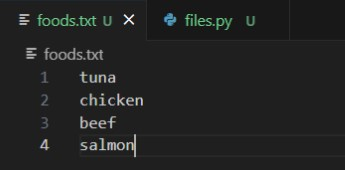
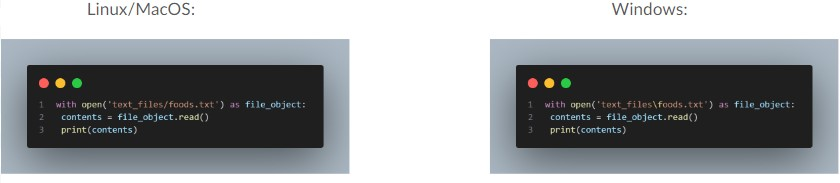
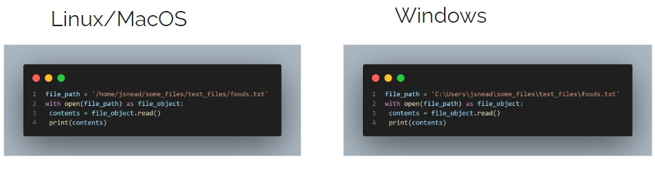

# Files and Exceptions

## Learning Objectives

- To learn how to store, modify, and access data in a text file from python program.
- Recap and Recall different file paths
- Understand exceptions and error handling

## I have a problem…  

I have too many dinner items for weasley and noche! This makes my code longer and harder to work with, and difficult to change.  

To solve my problem, I could store my data in a text file:  



Then I can access the contents through my code, like a simple database.  

The example below reads and prints the entire text file:  

```py
with open('foods.txt') as file_object:
    contents = file_object.read()
    print(contents)
```

There is a lot going on here though so let’s break it down.

---

### The open() function

```py
with open('foods.txt') as file_object:
```

To do anything with a file, you first need to open it, even if it is something as simple as printing the contents.

The `open()` function only requires one argument - what you want to open!

In our case, whatever is inside the text file can be referenced by a variable called `file_object` this allows us to work with the file in our code, without opening it over and over again.

Python will look for the file in the directory where the program that’s currently being executed is stored, which is fine if you save both .py and .txt files in the same directory.

### The read() method

```py
contents = file_object.read()
```

The `read()` method is exactly what it sounds like, it allows us to read the data in our file. 

To clarify, `open()` gives your code access to the file, but once we have access to it there could be various things we want to do, so far we're just using `read()` to view the file contents.

#### What if I want to store my text file in another directory?  

A ***relative*** file path tells Python to look for a given location relative to the directory where the currently running program file is stored. Just like in Linux! 

Depending on the OS, you will need to change the slashes!



This can be particularly useful as your application grows and contains many different files, and you need to organise and structure your resources.

***Absolute*** paths allow you to tell Python the exact path to get to your file, from the root of the file system, so it doesn't matter where your file is stored. 



---

### Some More File Methods


#### Read a File Line by Line:

```py
with open('foods.txt') as file_object:
    for line in file_object:
        print(line)
```

Notice we're using a for loop to iterate through each `line` in the `file_object` until all of the lines have been printed.

#### Making a List From a File

```py
with open('foods.txt') as file_object:
    lines = file_object.readlines()

for line in lines:
    print(line)
```

When you use `with`, the file content returned by `open()` is only available inside the ‘with-block’. If you want to have access to the content outside of the with-block, you can store it in a list then work with this list in the rest of the program. 

#### Writing to an Empty File

```py
filename = 'foods.txt'

with open(filename, 'w') as file_object:
    file_object.write("I love programming!")
    file_object.write("Noche and Weasley are hungry!")
```

Here we've put the name of the file into a variable, then we `open()` the file in ***write*** mode by using the `'w'` flag. Again it's opened as `file_object`, and we write two strings to the file using the `write()` method.

***Note:*** *If the file exists any content will be overwritten; If it doesn't exist it will be created.*

## Exceptions

Exceptions are errors from which your code cannot recover.  

You have probably seen a lot of these in the past, and a couple were mentioned in our earliest Python sessions.  

### Types of Exceptions

- **TypeError:** Raised when an operation or function is applied to an object of inappropriate type.
- **FileNotFoundError:** Raised when a file or directory is requested but cannot be found.
- **ZeroDivisionError:** Raised when division or modulo operation is performed with zero as the divisor.
- **SyntaxError:** Raised when the Python parser encounters a syntax error, such as incorrect indentation or invalid syntax.
- **IndentationError:** Raised when there is incorrect indentation in the code.

These are just a few, there are many more.

### Handling Exceptions with try-except blocks  

Exceptions are handled with `try-except` blocks which asks Python to do something, but also tell Python what to do if an exception is encountered.

When you use try-except blocks your programs will continue running, even if things start to go wrong. 

Additonally, instead of traceback messages which can be confusing for users to read, you can create user-friendly error messages that explain clearly what happened.

### Using try-except blocks

When you think an error may occur, you can write a try-except block to handle the exception that might be raised. 

```py
try
    print(5/0)
except ZeroDivisionError:
    print("You cannot divide by zero!")
```

You tell Python to try running some code, and you tell it what to do if the code results in a particular kind of exception.

#### Tips when handling exceptions

- Be specific in exception handling
- Print meaningful error messages
- Keep exception handling simple
- Test exception handling

## Storing Data

Sometimes you may want to ask users to input certain kinds of information, then you may want to store this information in data structures like lists and dictionaries.  

When the users close the program you may want this data to persist; Let's say, for example, you make a pizza ordering app - your users enter their order, and when they've finished their order details need to be saved, and passed through to the kitchen team.

A simple way to do this is storing your data in a json module.  

### JSON Modules

The json module allows you to dump simple Python data structures into a file and load the data from that file the next time the program runs. 

This data can also be used across different programs, because JSON is easily readable, and is a common method for making data transportable.

```py
import json

# Example data to be written to a JSON file
data = {
    "name": "Frankie",
    "age": 4,
    "fur": "shaded red"
}

# Write data to a JSON file using json.dump()
filename = "data.json"
with open(filename, "w") as json_file:
    json.dump(data, json_file)
print("Data successfully written to:", filename)

# Reading data from JSON file using json.load()
with open(filename, "r") as json_file:
    loaded_data = json.load(json_file)
print("Data loaded from:", filename, "-")
print(loaded_data)
```

This example looks a bit overwhelming, even with some comments included, but it's very similar to examples we've already seen, just all in one larger app. 

The first section is simply creating a dictionary object called `data` containing a collection of key value pairs. 

```py
import json

# Example data to be written to a JSON file
data = {
    "name": "Frankie",
    "age": 4,
    "fur": "shaded red"
}
```

KVP's organised into nested blocks are very common throughout the IT industry, alowing us to define objects like our pets in this example, but also for transferring and transporting data as mentioned, and commonly for storing application configuration settings.

In the next section a variable `filename` is declared, which contains the real filename data should be written to, the file is opened in write mode, and `json.duump` is used to add the contents of `data` declared above.

```py
# Write data to a JSON file using json.dump()
filename = "data.json"
with open(filename, "w") as json_file:
    json.dump(data, json_file)
print("Data successfully written to:", filename)
```

The final section re-opens the file (specifying read mode, but this is also the default), and re-loads the data which you previously added to the JSON file, stores it in the `loaded_data` variable, then prints it out.

```py
# Reading data from JSON file using json.load()
with open(filename, "r") as json_file:
    loaded_data = json.load(json_file)
print("Data loaded from:", filename, "-")
print(loaded_data)
```

While this app isn't very useful, in reality, the functions of writing data to and reading data from the data source might be two separate applications with different functions. 

For example, one app to add a new customer to a database, then another app to retrieve that customer's details when they call in at a later date for support, both apps can share a common data source.

### User Generated Data

In this example, rather than a pre-defined data object, the user's input is captured and stored in the JSON file.  
*Notice in this example the data is both stored, and printed out using an f-string*

```py
import json

cat = input("What is your cat's name?")

filename = 'cat.json'
with open(filename, 'w') as obj:
    json.dump(cat, obj)
    print(f"Welcome {cat}, I will remember you on your next visit!")
```

## Practice

Now practice implementing the skills demonstrating here by completing the associated exercises.